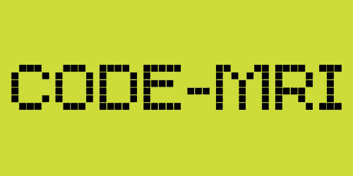

<div align="center">
  
  <h1>Code MRI</h1>
  <p><strong>Deterministic code intelligence for local coding agents.</strong></p>
  <p><sub>Supported MCP clients</sub></p>
  <table>
    <tr>
      <td align="center" width="120">
        <a href="https://openai.com/codex/">
          <picture>
            <source media="(prefers-color-scheme: dark)" srcset="https://svgl.app/library/codex_dark.svg">
            
          </picture>
        </a>
        <br />
        <sub>Codex</sub>
      </td>
      <td align="center" width="120">
        <a href="https://claude.ai/">
          
        </a>
        <br />
        <sub>Claude Code</sub>
      </td>
      <td align="center" width="120">
        <a href="https://www.cursor.com">
          <picture>
            <source media="(prefers-color-scheme: dark)" srcset="https://svgl.app/library/cursor_dark.svg">
            
          </picture>
        </a>
        <br />
        <sub>Cursor</sub>
      </td>
      <td align="center" width="120">
        <a href="https://windsurf.com/editor">
          <picture>
            <source media="(prefers-color-scheme: dark)" srcset="https://svgl.app/library/windsurf-dark.svg">
            
          </picture>
        </a>
        <br />
        <sub>Windsurf</sub>
      </td>
    </tr>
  </table>
  <p><sub>Supported frameworks</sub></p>
  <table>
    <tr>
      <td align="center" width="110">
        <a href="https://nextjs.org/">
          
        </a>
        <br />
        <sub>Next.js</sub>
      </td>
      <td align="center" width="110">
        <a href="https://react.dev/">
          <picture>
            <source media="(prefers-color-scheme: dark)" srcset="https://svgl.app/library/react_dark.svg">
            
          </picture>
        </a>
        <br />
        <sub>React</sub>
      </td>
      <td align="center" width="110">
        <a href="https://vitejs.dev">
          
        </a>
        <br />
        <sub>Vite</sub>
      </td>
      <td align="center" width="110">
        <a href="https://reactrouter.com/en/main">
          
        </a>
        <br />
        <sub>React Router</sub>
      </td>
      <td align="center" width="110">
        <a href="https://expressjs.com">
          <picture>
            <source media="(prefers-color-scheme: dark)" srcset="https://svgl.app/library/expressjs_dark.svg">
            
          </picture>
        </a>
        <br />
        <sub>Express</sub>
      </td>
    </tr>
    <tr>
      <td align="center" width="110">
        <a href="https://nestjs.com/">
          
        </a>
        <br />
        <sub>NestJS</sub>
      </td>
      <td align="center" width="110">
        <a href="https://www.djangoproject.com/">
          
        </a>
        <br />
        <sub>Django</sub>
      </td>
      <td align="center" width="110">
        <a href="https://fastapi.tiangolo.com/">
          
        </a>
        <br />
        <sub>FastAPI</sub>
      </td>
      <td align="center" width="110">
        <a href="https://flask.palletsprojects.com/">
          <picture>
            <source media="(prefers-color-scheme: dark)" srcset="https://svgl.app/library/flask-dark.svg">
            
          </picture>
        </a>
        <br />
        <sub>Flask</sub>
      </td>
      <td align="center" width="110">
        <strong>DRF</strong><br />
        <sub>+ OpenAPI import</sub>
      </td>
    </tr>
  </table>
</div>

Local-first codebase intelligence with a local Next.js UI, CLI, CI gates, and
MCP tools for coding agents. Code MRI scans TypeScript, React, Next.js, Node
APIs, and Python web backends, then turns the source into a deterministic graph
of files, symbols, routes, API calls, models, serializers, services, Docker
services, and issues.

The fastest way to understand a project is the frontend: run the local UI, add
or scan a repository, and inspect the generated architecture, API, impact,
dead-code, circular-dependency, risk, and change data without sending code to a
remote service.

Code MRI is not an LLM analyzer. The engine is deterministic static analysis.
AI tools can use the graph through the CLI or MCP server, but the facts come
from the local report.

## AI Agent MCP Quick Install

For Codex, Claude Code, Cursor, Windsurf, or another MCP client, install the
agent-facing server with the engine package only:

```bash
npx -y @code-mri/engine@latest mcp --allow-scan --state-dir .code-mri
```

Copy this config into an MCP client and set `cwd` to the project root the agent
should scan:

```json
{
  "mcpServers": {
    "code-mri": {
      "command": "npx",
      "args": [
        "-y",
        "@code-mri/engine@latest",
        "mcp",
        "--allow-scan",
        "--state-dir",
        ".code-mri"
      ],
      "cwd": "/absolute/path/to/your/project"
    }
  }
}
```

For Codex Desktop, use this TOML block in `~/.codex/config.toml`:

```toml
[mcp_servers.code-mri]
command = "npx"
args = ["-y", "@code-mri/engine@latest", "mcp", "--allow-scan", "--state-dir", ".code-mri"]
cwd = "/absolute/path/to/your/project"
startup_timeout_sec = 120
```

After the server is connected, ask the agent to use the context-router flow:
`scan_project` -> `prepare_edit_context` -> `read_windows` ->
`review_planned_change` -> edit -> `review_diff` -> `recommend_tests`.

You do not install a second Code MRI package for MCP. The report schema types
are exported from `@code-mri/engine`.

## What It Answers

- If I change this file, component, endpoint, model, or field, what is affected?
- Which frontend pages call this backend route?
- Which backend endpoints are unused or only weakly linked?
- Which exported symbols look unused, and which are intentionally public API?
- Are there circular dependencies, large files, god components, or god models?
- Did this branch introduce a breaking route, method, field, or boundary change?
- Which tests or typechecks should run for this planned edit?

## Current Capabilities

- Single-repo and multi-repo project scans.
- TypeScript/React/Next.js/Vite/React Router graph extraction.
- Express and NestJS route extraction.
- Django/DRF, FastAPI, and Flask route/model/schema extraction through a Python
  sidecar.
- OpenAPI import for stronger frontend/backend linking.
- Docker Compose service graph extraction.
- Cross-stack API linking with confidence levels.
- Dead-code candidates with public API handling.
- Boundary/governance rules through `.codemri.yml`.
- Git churn, coverage, complexity, fan-in/fan-out, hotspot, and security-signal
  insights.
- Snapshot diff, breaking-change detection, CI gates, PR Markdown, and SARIF.
- Incremental parser cache for faster repeated scans.
- Next.js desktop UI for local project management and graph exploration.
- MCP stdio server for coding agents.

## Repository Layout

```text
code-mri/
├── apps/desktop/             # local Next.js UI with SQLite project state
├── engine/                   # scanner, parsers, graph, linker, rules, CLI, CI, MCP
│   └── test/fixtures/        # engine-only fixture projects and golden snapshots
├── docs/                     # MCP, security, publishing, and limitations docs
└── TASKS.md                  # local roadmap/status file, gitignored
```

## Requirements

- Node.js 24 LTS is the target runtime. The desktop app uses `node:sqlite` and
  runs with `NODE_OPTIONS=--experimental-sqlite`.
- pnpm 9.12 through Corepack.
- Python 3.9+ for Python backend analysis.

```bash
corepack enable pnpm
pnpm install
```

## Quick Start With The Local UI

Install dependencies and start the frontend:

```bash
corepack enable pnpm
pnpm install
pnpm --filter @code-mri/desktop dev
```

Open the printed local URL. From the UI, add a local project, run a scan, and
inspect the report screens:

- Overview
- Architecture Map
- API Map
- Impact
- Dead Code
- Circular
- Risk Dashboard
- Insights
- What Changed
- Settings

The UI stores local project metadata in SQLite and uses the same deterministic
engine as the CLI and MCP server.

## CLI Quick Start

Build the engine:

```bash
pnpm --filter @code-mri/engine build
```

Scan a repository:

```bash
node engine/dist/cli/index.js scan . \
  --json .code-mri/current-report.json \
  --cache-dir .code-mri/cache
```

Create a starter config:

```bash
node engine/dist/cli/index.js init-config --preset next-django
```

Ask the graph from a saved report:

```bash
node engine/dist/cli/index.js ask-graph \
  --report .code-mri/current-report.json \
  "what is impacted by src/app/users/page.tsx?"
```

For workspace development, the root scripts wrap the engine package:

```bash
pnpm scan .
node engine/dist/cli/index.js mcp --allow-scan --state-dir .code-mri
```

After npm publishing, the public entry point is:

```bash
npx -y @code-mri/engine scan . --json .code-mri/current-report.json
```

## CLI

The CLI binary is `code-mri` from `@code-mri/engine`.

```text
code-mri scan <path>
code-mri scan-project --repo frontend=/path/to/web:frontend --repo backend=/path/to/api:backend
code-mri diff before.json after.json
code-mri ci [path]
code-mri ask-graph --report report.json "question"
code-mri mcp [options]
code-mri suggest-boundaries report.json
code-mri init-config --preset next-django
```

### `scan`

Runs a single-repo scan.

```bash
code-mri scan . \
  --json .code-mri/current-report.json \
  --openapi ./openapi.yaml \
  --coverage ./coverage/lcov.info \
  --cache-dir .code-mri/cache
```

Useful options:

- `--json <file>` writes the full report.
- `--openapi <file>` links frontend calls against OpenAPI routes.
- `--coverage <file>` loads lcov or Istanbul coverage.
- `--config <file>` overrides `.codemri.yml` discovery.
- `--no-git` skips churn collection.
- `--cache-dir <dir>` enables persistent incremental cache.
- `--no-cache` bypasses incremental cache.

### `scan-project`

Scans several local repositories into one logical report.

```bash
code-mri scan-project \
  --name "Acme Platform" \
  --repo frontend=/work/acme-web:frontend \
  --repo backend=/work/acme-api:backend \
  --repo-name frontend="Web App" \
  --repo-name backend="API" \
  --json .code-mri/current-report.json \
  --cache-dir .code-mri/cache
```

Supported repo roles are `frontend`, `backend`, `fullstack`, `worker`, and
`other`.

### `diff`

Compares two reports and surfaces graph, issue, health, and breaking-change
deltas.

```bash
code-mri diff .code-mri/baseline-report.json .code-mri/current-report.json
```

### `ask-graph`

Routes a natural-language question to a deterministic graph query.

```bash
code-mri ask-graph --report .code-mri/current-report.json \
  "which tests should I run for engine/src/mcp/server.ts?"
```

The router is transparent: it reports the selected graph tool and returns
sourced graph data from the report.

## Configuration

Code MRI auto-discovers `.codemri.yml`, `.codemri.yaml`, or `.codemri.json` from
the scanned roots. Use `--config <file>` to override discovery.

Generate a starter config:

```bash
code-mri init-config --preset next-django
```

Available presets:

- `next`
- `next-django`
- `vite-react`
- `node-api`
- `python-api`
- `library`

Example:

```yaml
boundaries:
  groups:
    - id: ui
      paths:
        - apps/web/**
        - frontend/**
    - id: backend
      paths:
        - apps/api/**
        - backend/**
  rules:
    - from: ui
      to: backend
      allow: false
      edgeKinds:
        - IMPORTS

publicApi:
  exports:
    - paths:
        - packages/ui/src/index.ts
      kinds:
        - Component
        - Hook
    - paths:
        - backend/**/views.py

ci:
  gates:
    minHealth: 85
    maxNewIssues: 0
    forbidBreakingChanges: true
    forbidBoundaryViolations: true
    minCoveragePct: 80

risk:
  ignorePaths:
    - "**/*.test.ts"
    - "**/*.test.tsx"
    - examples/**
    - fixtures/**
    - dist/**
    - .next/**
```

Config behavior:

- `boundaries` emits `BOUNDARY_VIOLATION` issues when disallowed graph edges are
  found.
- `publicApi` marks intentionally exported symbols so public surfaces are not
  treated like internal dead-code candidates.
- `ci.gates` controls `code-mri ci` pass/fail behavior.
- `risk.ignorePaths` keeps matching files searchable in the graph but removes
  matching issues from health/risk scoring.

To bootstrap governance from an existing report:

```bash
code-mri suggest-boundaries .code-mri/current-report.json
```

## CI And Headless Mode

`code-mri ci` runs a scan, optionally compares it with a baseline, evaluates
configured gates, and writes CI artifacts.

```bash
code-mri ci . \
  --baseline .code-mri/baseline-report.json \
  --update-baseline \
  --cache-dir .code-mri/cache \
  --json .code-mri/current-report.json \
  --diff-json .code-mri/diff.json \
  --markdown code-mri-pr.md \
  --sarif code-mri.sarif \
  --progress
```

Exit codes:

- `0`: gates passed.
- `1`: gates failed.
- `2`: runtime or configuration error.

`--progress` writes deterministic JSONL events to stderr so stdout remains a
stable human summary. If `--baseline` is omitted and `--cache-dir` is set, CI
uses `.code-mri/cache/baseline-report.json` as the fallback baseline path.

## Desktop UI

The desktop surface is a Next.js app, not an Electron or Tauri shell. It keeps
local project state in SQLite, starts scans through the engine CLI child
process, and renders report screens for repeated local inspection. This is the
recommended first local experience before using CI or MCP automation.

Run it locally:

```bash
pnpm --filter @code-mri/desktop dev
```

Then open the printed local URL and add or scan a local project.

SQLite path resolution:

1. `CODE_MRI_DB_PATH`
2. `CODE_MRI_APP_DATA_DIR/code-mri.sqlite`
3. OS app-data in production
4. `.code-mri/code-mri.sqlite` in local development

## MCP Server

Code MRI includes a first-class MCP stdio server for coding agents. The intended
workflow is: scan once, keep the report active, then let the agent ask for a
token-budgeted edit context instead of reading broad source files into the
model.

Start from npm:

```bash
npx -y @code-mri/engine@latest mcp --allow-scan --state-dir .code-mri
```

Start from this repository:

```bash
pnpm --filter @code-mri/engine build
node engine/dist/cli/index.js mcp --allow-scan --state-dir .code-mri
```

### MCP State Layout

With `--state-dir .code-mri`, `scan_project` uses:

```text
.code-mri/
├── current-report.json    # latest scan_project report
├── baseline-report.json   # optional baseline for diff/breaking-change tools
└── cache/                 # incremental parser cache
```

### MCP Modes

Report-only mode loads an existing report and does not expose scanning tools:

```bash
code-mri mcp \
  --report .code-mri/current-report.json \
  --baseline .code-mri/baseline-report.json
```

Scan-enabled mode exposes `scan_project` and `load_report`:

```bash
code-mri mcp --allow-scan --state-dir .code-mri
```

Use report-only mode for locked-down CI artifacts. Use scan-enabled mode for
local agents that should refresh the graph while working.

### MCP Tools

- `scan_project`: opt-in live scan; updates the active report and can write it
  to state.
- `load_report`: loads an existing report JSON into the active MCP context.
- `prepare_edit_context`: returns must-read line windows, impacts, risks,
  tests, and next tool calls for a planned task.
- `read_windows`: returns bounded source line windows; secret candidates are
  redacted and `mode="locations"` can be used when source should stay omitted.
- `review_planned_change`: checks an edit plan before code changes.
- `review_diff`: checks changed files or unified diff text after code changes.
- `graph_search`: searches nodes by id, name, source file, and naming variants.
- `impact_query`: returns impacted nodes for a file or symbol; file queries
  expand to contained symbols and direct importers.
- `get_node_context`: returns a node, attached issues, and incoming/outgoing
  edges.
- `find_dead_code`: returns dead-code and unused-endpoint candidates.
- `check_breaking_changes`: returns breaking issues and baseline diff risks.
- `ask_graph`: routes natural language to a deterministic graph tool.
- `recommend_tests`: suggests focused test/typecheck/build commands as data.

All tools return structured MCP content. Result schemas include `tool`, `plan`,
`confidence`, `loc`, `message`, `resultStats`, and optional `nextQueries`. By
default, `content.text` is a short summary and full data is in
`structuredContent`; use `--mcp-text-mode json` only for clients that parse text
JSON. Query tools accept `detail`, `tokenBudget`, `includeEvidence`, and `limit`
so agents can start brief and request fuller detail only when needed.

Recommended agent playbook:

1. `scan_project` or `load_report`.
2. `prepare_edit_context` with the user task and a token budget.
3. `read_windows` for returned `mustRead` windows only.
4. `review_planned_change` before editing.
5. `review_diff` after editing.
6. `recommend_tests`, then run the returned commands.

### MCP Client Config

Minimal Codex, Claude Code, Cursor, or Windsurf-style config:

```json
{
  "mcpServers": {
    "code-mri": {
      "command": "npx",
      "args": [
        "-y",
        "@code-mri/engine@latest",
        "mcp",
        "--allow-scan",
        "--state-dir",
        ".code-mri"
      ],
      "cwd": "/absolute/path/to/project"
    }
  }
}
```

For a local checkout before publishing:

```json
{
  "mcpServers": {
    "code-mri": {
      "command": "node",
      "args": [
        "/absolute/path/to/code-mri/engine/dist/cli/index.js",
        "mcp",
        "--allow-scan",
        "--state-dir",
        "/absolute/path/to/project/.code-mri"
      ],
      "cwd": "/absolute/path/to/project"
    }
  }
}
```

See [docs/mcp-server.md](docs/mcp-server.md) and
[docs/mcp-clients.md](docs/mcp-clients.md) for more setup examples.

## Public Packages

Publishable package:

- `@code-mri/engine`: public CLI, engine API, report schema types, CI helpers,
  and MCP server.

The engine package exposes:

- CLI binary: `code-mri`
- package export: `@code-mri/engine`
- diff export: `@code-mri/engine/diff`

Older `@code-mri/shared-types` releases are deprecated; consumers should import
report and graph types from `@code-mri/engine`.

Publishing checklist lives in [docs/publishing.md](docs/publishing.md).

## How The Engine Works

```text
scan roots
  -> file classifier and tech detector
  -> TS/React/Next/Vite/Express/Nest parsers
  -> Python sidecar for Django/DRF/FastAPI/Flask
  -> OpenAPI and Docker Compose adapters
  -> graph builder
  -> cross-stack linker
  -> rule engine and insights
  -> health score, report JSON, diff, CI, MCP, desktop UI
```

The report graph is the common contract. CLI output, desktop screens, CI gates,
and MCP tools all consume the same report shape exported by `@code-mri/engine`.

## Development

Run the full workspace checks:

```bash
pnpm test
pnpm typecheck
pnpm build
```

Common focused checks:

```bash
pnpm --filter @code-mri/engine test
pnpm --filter @code-mri/engine typecheck
pnpm --filter @code-mri/engine build

pnpm --filter @code-mri/desktop test
pnpm --filter @code-mri/desktop typecheck
pnpm --filter @code-mri/desktop build
```

Package dry-run:

```bash
cd engine
pnpm pack --pack-destination /tmp/code-mri-pack
```

Use `pnpm pack` or `pnpm publish` for release checks.

Engine fixture projects and the golden report snapshot live under
`engine/test/fixtures`. They are for parser and pipeline tests, not a public
example-project entry point.

## Security Model

Code MRI is local-first:

- It does not call an LLM or remote analysis API.
- The scanner reads files available to the local process.
- MCP `scan_project` can write report and cache artifacts under the configured
  state/cache paths.
- MCP `recommend_tests` returns commands as data; it does not execute them.
- Secret findings are heuristic and masked, intended as review prompts rather
  than proof.

For untrusted repositories, run Code MRI in a sandboxed working directory and
keep `--allow-scan` scoped to that project. See [docs/security.md](docs/security.md).

## Limitations

Code MRI uses static analysis. It does not execute the target application.
Runtime-only route construction, heavily dynamic API clients, dynamic serializer
fields, generated code, plugin systems, and framework conventions may need
`publicApi`, `risk.ignorePaths`, OpenAPI input, or manual review. Dead-code
results are candidates, not deletion instructions.

See [docs/limitations.md](docs/limitations.md) for the detailed list.

## Status

The local roadmap through agent/MCP integration is implemented. Current work is
Phase 16: turning MCP into a token-budgeted agent context router so AI agents
can inspect impact, context, and tests without reading the whole repo into the
model.
